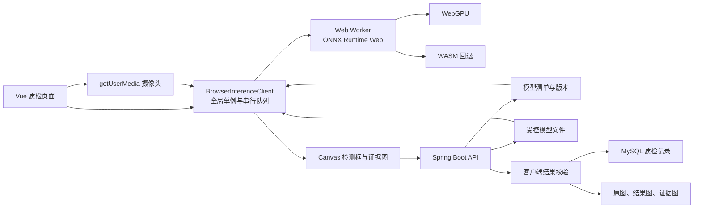

# 13 前端 ONNX 推理完整实施方案

> 适用项目：织慧通 SaaS  
> 技术基线：Vue 3 + Vite + TypeScript + Spring Boot + MySQL  
> 文档用途：交给开发人员或另一个 AI，按本文完成从“后端 ONNX 推理”到“浏览器 ONNX 推理”的完整改造。  
> 结论优先：模型在浏览器的 Web Worker 中运行，优先使用 WebGPU，失败时回退到 WASM；后端不再执行模型，只负责模型分发、业务校验、文件保存、记录落库和后续 AI 分析。

截至 2026-08-06，本文方案已落地。Java ONNX Runtime、后端 WebSocket 帧推理、同步快照和旧 `detect-image`/`detect-frame` 接口已删除；当前代码以浏览器 Worker 推理、证据有界异步队列、后端结果校验和业务落库为准。本文后面的“迁移阶段/旧实现”文字保留作历史决策记录，不代表当前仍存在对应代码。

## 1. 改造目标

### 1.1 当前实现

历史链路（已删除）是：

1. 图片质检把原图上传到后端。
2. 实时质检把摄像头帧压缩为图片，通过 WebSocket 发送到后端。
3. 后端 `OnnxYoloService` 使用 Java ONNX Runtime 执行推理。
4. 后端生成检测框、结果图并保存质检记录。

主要关联文件：

```text
frontend/src/views/quality/RealtimeInspect.vue
frontend/src/api/quality/qcRecord.ts
frontend/src/api/quality/qcStreamSession.ts

backend/src/main/java/com/zhihuitong/modules/ai/service/OnnxYoloService.java
backend/src/main/java/com/zhihuitong/modules/quality/service/InspectionIntegrationService.java
backend/src/main/java/com/zhihuitong/modules/quality/service/QcStreamSessionService.java
```

### 1.2 目标实现

改造后的链路是：

1. 后端发布当前激活模型的清单和模型文件。
2. 前端下载模型，在 Web Worker 中初始化 ONNX Runtime Web。
3. 图片和摄像头帧都在浏览器本地完成预处理、模型推理、后处理和检测框绘制。
4. 前端只把需要保存的结构化检测结果、原图和结果图提交给后端。
5. 后端验证模型版本、类别、坐标、文件和业务上下文后写入 MySQL。
6. DeepSeek 等大模型能力继续读取后端已保存的质检记录，不直接参与目标检测。

本次改造不改变质检任务、质检标准、工序计划、人工复核和 AI 质量分析等业务模型。

## 2. 总体架构



### 2.1 职责边界

| 模块 | 负责 | 不负责 |
| --- | --- | --- |
| 浏览器主线程 | 页面状态、摄像头、推理调度、结果展示、业务提交 | 直接执行耗时 ONNX 计算 |
| Web Worker | 模型初始化、预处理、推理、后处理、资源释放 | DOM、业务请求、数据库 |
| 后端 | 模型清单、模型下载、结果校验、业务编排、文件和数据库 | 实时模型推理 |
| MySQL | 模型元数据、质检记录、检测框、事件和业务关联 | 保存模型运行时对象 |
| 文件存储 | 模型、原图、结果图、证据图 | 业务状态判断 |

### 2.2 六条不可破坏的约束

1. 整个前端应用只能共享一个 `BrowserInferenceClient` 和一个活动 ONNX Session。
2. 所有 `session.run()` 必须串行执行，图片质检和实时质检不能并发进入同一 Session。
3. 前后端必须使用同一个模型 SHA-256 和同一份类别顺序。
4. 前端返回的检测框统一使用原图像素坐标，不使用模型输入坐标或页面显示坐标。
5. 后端不能直接信任浏览器提交的结果，必须重新校验模型版本、类别和坐标。
6. 页面显示“WebGPU”只能依据 Session 实际初始化结果，不能依据系统显卡设置推断。

其中第 2 条是稳定性的核心。只设置实时页面的 `inferenceInFlight` 仍然不够，因为用户可能在实时质检运行时打开图片质检，两个页面会争用同一个 Session。必须同时在客户端和 Worker 内建立串行队列。

## 3. 模型准入与模型契约

### 3.1 首先检查真实模型

实施前必须检查 `docs/best.onnx`，记录以下真实信息：

| 检查项 | 必须得到的结果 |
| --- | --- |
| 输入名称 | 例如 `images` |
| 输入类型 | 通常为 `float32` |
| 输入形状 | 例如 `[1,3,640,640]` |
| 输出名称 | 例如 `output0` |
| 输出类型 | 通常为 `float32` |
| 输出形状 | 静态或一次真实推理后的实际形状 |
| 类别顺序 | 索引 0 到 N-1 对应的标签 |
| 坐标格式 | `cxcywh` 或 `xyxy` |
| 输出类型 | 原始 YOLO 输出或已经 NMS 的输出 |
| Objectness | 是否包含独立目标置信度 |
| 归一化 | 坐标和像素是否归一化 |
| ONNX 算子兼容性 | WebGPU 初始化和一次真实推理是否成功 |

不得因为模型文件名相同就沿用旧模型的输入输出规则。模型替换时，类别、输出形状、预处理或后处理都可能变化。

### 3.2 模型清单

后端提供：

```text
GET /api/ai/browser-inference/manifest
```

建议返回以下结构：

```ts
export interface BrowserModelManifest {
  modelName: string
  modelVersion: string
  modelUrl: string
  sha256: string
  fileSize: number

  inputName: string
  outputName: string
  inputWidth: number
  inputHeight: number
  inputLayout: 'NCHW'
  inputColor: 'RGB'
  normalizationScale: number
  letterboxFill: number

  decoder: {
    type: 'yolo-raw' | 'nms-xyxy6'
    outputLayout: 'BCN' | 'BNC'
    boxFormat: 'cxcywh' | 'xyxy'
    hasObjectness: boolean
    coordinatesNormalized: boolean
  }

  classes: Array<{
    index: number
    code: string
    name: string
    color: string
  }>

  confidenceThreshold: number
  iouThreshold: number
  realtimeConfidenceThreshold: number
  targetInferenceFps: number
  continuousHitFrames: number
  evidenceImageCount: number
  preferredExecutionProviders: Array<'webgpu' | 'wasm'>
}
```

`decoder` 的值必须来自真实模型检查结果，不能让前端按输出维数猜测生产模型类型。为了兼容迁移，可在开发期提供自动识别，但上线前必须固化为明确配置并增加测试。

### 3.3 类别的唯一来源

类别索引必须与模型训练时的顺序完全一致。推荐流程：

1. 模型元数据或随模型发布的 YAML/JSON 保存原始类别顺序。
2. 后端启动时读取并校验该顺序。
3. 后端把索引、业务编码、中文名和颜色写入模型清单。
4. 前端只消费模型清单，不维护第二份硬编码数组。
5. 模型切换时，模型文件、SHA-256、类别映射和解码配置必须作为一个版本同时生效。

如果数据库中的质检标准名称与模型标签不同，应通过显式映射表关联，不能按数据库查询顺序充当模型类别顺序。

### 3.4 模型版本与下载

后端提供：

```text
GET /api/ai/browser-inference/model?sha256={sha256}
```

要求：

- 请求中的 SHA-256 必须等于当前激活模型。
- 返回 `application/octet-stream`。
- 返回 `Content-Length`。
- 返回 `ETag: "{sha256}"`。
- 返回 `Cache-Control: private, max-age=604800, immutable`。
- 模型替换后 URL 中的 SHA-256 随之变化，避免旧缓存污染。
- 读取模型摘要时按文件大小和最后修改时间做服务端缓存，不能每次请求都重新计算整文件摘要。

本项目使用 Bearer Token。Web Worker 直接 `fetch(modelUrl)` 不会自动经过 Axios 拦截器，因此推荐由主线程通过现有请求模块下载 `ArrayBuffer`，再用 Transferable 零拷贝传给 Worker：

```ts
export const downloadBrowserModel = (modelUrl: string) =>
  request<ArrayBuffer>({
    url: modelUrl,
    method: 'get',
    responseType: 'arraybuffer',
    timeout: 180_000,
    silentError: true,
  })
```

模型 Token 不得写入清单、URL、日志或浏览器持久化缓存。若未来改为 HttpOnly Cookie 鉴权，也可以让 Worker 使用同源 `fetch` 直接下载。

## 4. 前端目录与依赖

### 4.1 建议目录

```text
frontend/src/
├── api/quality/
│   ├── browserInference.ts
│   ├── qcRecord.ts
│   └── qcStreamSession.ts
├── inference/
│   ├── types.ts
│   ├── browserInferenceClient.ts
│   ├── inference.worker.ts
│   ├── preprocess.ts
│   ├── postprocess.ts
│   ├── rendering.ts
│   ├── realtimeHitTracker.ts
│   ├── browserInferenceClient.test.ts
│   ├── postprocess.test.ts
│   └── realtimeHitTracker.test.ts
├── composables/
│   └── useBrowserRealtimeInspection.ts
└── views/quality/
    └── RealtimeInspect.vue
```

### 4.2 固定依赖版本

至少增加：

```json
{
  "dependencies": {
    "onnxruntime-web": "1.27.0"
  },
  "devDependencies": {
    "vite-plugin-static-copy": "^2.3.2",
    "vitest": "^3.2.4"
  }
}
```

`onnxruntime-web` 建议固定精确版本。升级时必须重新验证 WASM 文件名、WebGPU 兼容性、输出 Tensor 类型和真实浏览器回归。

### 4.3 Vite 配置

```ts
import { viteStaticCopy } from 'vite-plugin-static-copy'

export default defineConfig({
  plugins: [
    vue(),
    viteStaticCopy({
      targets: [
        {
          src: 'node_modules/onnxruntime-web/dist/ort-wasm-simd-threaded.asyncify.{mjs,wasm}',
          dest: 'ort',
        },
      ],
    }),
  ],
  resolve: {
    alias: {
      '@': fileURLToPath(new URL('./src', import.meta.url)),
    },
    conditions: ['onnxruntime-web-use-extern-wasm'],
  },
  server: {
    headers: {
      'Cross-Origin-Opener-Policy': 'same-origin',
      'Cross-Origin-Embedder-Policy': 'require-corp',
      'Cross-Origin-Resource-Policy': 'same-origin',
    },
    proxy: {
      '/prod-api': {
        target: 'http://localhost:8080',
        changeOrigin: true,
        ws: true,
        rewrite: (path) => path.replace(/^\/prod-api/, ''),
      },
    },
  },
})
```

构建后必须检查：

```text
dist/ort/ort-wasm-simd-threaded.asyncify.mjs
dist/ort/ort-wasm-simd-threaded.asyncify.wasm
```

## 5. Worker 推理引擎

### 5.1 为什么必须使用 Worker

模型下载、图像预处理、Tensor 构造、`session.run()` 和后处理都可能阻塞主线程。放入 Worker 后，摄像头预览、检测框绘制和页面交互不会因单次推理产生明显卡顿。

Worker 内使用：

```ts
import * as ort from 'onnxruntime-web/webgpu'

ort.env.wasm.wasmPaths = '/ort/'
ort.env.wasm.proxy = false
ort.env.wasm.numThreads = self.crossOriginIsolated
  ? Math.min(4, Math.max(1, Math.floor((navigator.hardwareConcurrency || 2) / 2)))
  : 1
```

### 5.2 初始化顺序

初始化必须按以下状态执行：

```text
UNINITIALIZED
  -> DOWNLOADING
  -> VERIFYING_SHA256
  -> CREATING_SESSION
  -> WARMING_UP
  -> READY
```

步骤：

1. 主线程获取模型清单。
2. 如果 SHA-256 与已加载模型一致，只刷新阈值和类别元数据。
3. 如果 SHA-256 不同，主线程鉴权下载模型字节。
4. 将 `ArrayBuffer` 转移给 Worker。
5. Worker 用 `crypto.subtle.digest('SHA-256', bytes)` 校验。
6. Worker 尝试获取 WebGPU Adapter，等待上限建议为 1500 ms。
7. WebGPU 可用时创建 `executionProviders: ['webgpu', 'wasm']` 的 Session。
8. WebGPU 初始化失败时重新创建纯 WASM Session。
9. 用全零 Tensor 预热一次。
10. 返回真实 Provider、模型 SHA、初始化耗时和预热耗时。

只有步骤 7 实际成功后，界面才能显示 `WebGPU/WASM`。仅检测到 `navigator.gpu` 或 Windows 中选择了高性能显卡都不能证明模型已在 GPU 上执行。

### 5.3 Worker 消息协议

```ts
export type WorkerRequest =
  | {
      type: 'init'
      requestId: string
      manifest: BrowserModelManifest
      modelBytes: ArrayBuffer
    }
  | {
      type: 'infer'
      requestId: string
      bitmap: ImageBitmap
      confidenceThreshold: number
      iouThreshold: number
    }
  | {
      type: 'dispose'
      requestId: string
    }

export type WorkerResponse =
  | { type: 'ready'; requestId: string; payload: InferenceReady }
  | { type: 'result'; requestId: string; payload: BrowserInferenceResult }
  | { type: 'disposed'; requestId: string }
  | { type: 'error'; requestId: string; message: string; code?: string }
```

`ImageBitmap` 和 `ArrayBuffer` 必须通过 Transferable 传递：

```ts
worker.postMessage(request, [bitmap])
worker.postMessage(initRequest, [modelBytes])
```

### 5.4 Worker 内第二层串行队列

即使主线程已有队列，Worker 仍必须防御性串行处理消息：

```ts
let requestTail: Promise<void> = Promise.resolve()

self.onmessage = (event: MessageEvent<WorkerRequest>) => {
  const request = event.data
  requestTail = requestTail.then(
    () => processRequestSafely(request),
    () => processRequestSafely(request),
  )
}

async function processRequestSafely(request: WorkerRequest) {
  try {
    await handleRequest(request)
  } catch (error) {
    postError(request.requestId, error)
  }
}
```

`processRequestSafely` 必须吞掉单次请求异常并返回已完成 Promise，避免一次失败让后续队列永久跳过。

### 5.5 资源释放

每次推理必须在 `finally` 中释放：

- 输入 Tensor；
- 输出 Tensor；
- `ImageBitmap`；
- 临时 GPU/WASM 资源。

停止质检或模型切换时：

- `await session.release()`；
- 清空画布、上下文和预分配数组引用；
- 终止 Worker；
- 拒绝全部未完成请求。

## 6. 图像预处理

推荐使用 `OffscreenCanvas`，并复用画布和 `Float32Array`。

### 6.1 Letterbox

```text
scale = min(modelWidth / sourceWidth, modelHeight / sourceHeight)
resizedWidth = round(sourceWidth * scale)
resizedHeight = round(sourceHeight * scale)
padX = floor((modelWidth - resizedWidth) / 2)
padY = floor((modelHeight - resizedHeight) / 2)
```

先用模型契约中的填充值铺满画布，再把图片绘制到 `(padX, padY)`。必须保存：

```ts
export interface LetterboxTransform {
  originalWidth: number
  originalHeight: number
  modelWidth: number
  modelHeight: number
  scale: number
  padX: number
  padY: number
}
```

### 6.2 RGB、NCHW 与归一化

Canvas 返回 RGBA，模型通常需要 RGB NCHW：

```text
R 平面：data[0 ... H*W)
G 平面：data[H*W ... 2*H*W)
B 平面：data[2*H*W ... 3*H*W)
```

每个像素按模型契约归一化，例如除以 255。不能把 RGBA 原始排列直接传入模型。

### 6.3 坐标还原

模型坐标还原到原图：

```text
x = (modelX - padX) / scale
y = (modelY - padY) / scale
```

还原后必须裁剪到：

```text
0 <= x <= originalWidth
0 <= y <= originalHeight
```

无面积框、非有限数、反向坐标和越界框全部丢弃。

## 7. 模型后处理

### 7.1 两类解码器

实现时至少支持两种显式解码器：

| 解码器 | 常见输出 | 处理 |
| --- | --- | --- |
| `yolo-raw` | `[1,4+C,N]`、`[1,N,4+C]`，也可能含 objectness | 解析 `cxcywh`、类别分数，再执行 NMS |
| `nms-xyxy6` | `[1,N,6]`、`[1,6,N]` | 解析 `x1,y1,x2,y2,score,class`，再做必要的类别 NMS |

不能把某一个项目中已经 NMS 的输出格式直接套到本项目的 `best.onnx`。应先检查实际模型，再由清单中的 `decoder.type` 选择实现。

### 7.2 原始 YOLO 输出

若输出为原始预测：

1. 按清单确定 BCN 或 BNC。
2. 按清单确定是否有 objectness。
3. 找到最高类别分数。
4. `confidence = objectness * classScore`，无 objectness 时为 `classScore`。
5. 低于阈值的候选框直接过滤。
6. 将 `cxcywh` 转为 `xyxy`。
7. 去除 Letterbox 填充并恢复到原图坐标。
8. 按类别执行 NMS。

### 7.3 类别感知 NMS

只抑制同类别框：

```text
IoU = intersectionArea / (areaA + areaB - intersectionArea)
```

处理顺序：

1. 按置信度降序。
2. 取当前最高框。
3. 删除与其同类别且 IoU 大于阈值的框。
4. 继续直到候选列表为空。

输出统一为：

```ts
export interface BrowserDetection {
  classIndex: number
  code: string
  label: string
  color: string
  score: number
  x1: number
  y1: number
  x2: number
  y2: number
  width: number
  height: number
  area: number
}
```

## 8. BrowserInferenceClient

### 8.1 全局单例

```ts
export const browserInferenceClient = new BrowserInferenceClient()
```

图片页面、实时页面、首页预览等所有入口只能引用该实例，不能各自 `new Worker()`。

### 8.2 第一层串行队列

```ts
private operationTail: Promise<void> = Promise.resolve()

private enqueueOperation<T>(operation: () => Promise<T>) {
  const result = this.operationTail.then(operation)
  this.operationTail = result.then(
    () => undefined,
    () => undefined,
  )
  return result
}
```

以下操作全部通过 `enqueueOperation`：

- `ensureReady()`；
- `infer()`；
- `dispose()`；
- 模型刷新。

这样即使实时质检与图片质检同时发起请求，也不会并发调用共享 Session。

### 8.3 请求映射、超时和自动重置

每个请求生成唯一 `requestId`，主线程维护：

```ts
Map<requestId, {
  resolve: Function
  reject: Function
  timeout: number
}>
```

建议超时：

| 操作 | 超时 |
| --- | --- |
| 模型下载和首次初始化 | 180 秒 |
| 普通推理 | 30 秒 |
| 释放 | 5 秒 |

任一 Worker 超时、`onerror` 或 `onmessageerror` 发生时：

1. 终止当前 Worker。
2. 清空 Manifest 和 Ready 状态。
3. 拒绝全部 Pending 请求。
4. 下一次调用重新创建 Worker 和加载模型。

图片质检可对“Worker 异常”或“响应超时”执行一次自动重试，不能无限重试。

## 9. 图片质检流程

### 9.1 前端流程

1. 用户选择图片，只创建本地预览，不立即上传。
2. 调用 `browserInferenceClient.ensureReady(true)`。
3. 按图片顺序串行处理，每次创建 `ImageBitmap`。
4. Worker 返回原图坐标系中的检测框和三个阶段耗时。
5. 主线程使用 Canvas 绘制结果图。
6. 将原图、结果图和结构化检测结果一次性提交后端。
7. 后端返回与现有 `QcDetectionResult` 兼容的结果，页面继续显示记录和附件。

图片批量处理也应串行执行，避免模型内存峰值和浏览器 GPU 资源竞争。

### 9.2 新的保存接口

建议新增：

```text
POST /api/qc-records/client-detect-results
Content-Type: multipart/form-data
```

表单字段：

| 字段 | 类型 | 说明 |
| --- | --- | --- |
| `payload` | JSON Blob | 业务上下文、模型版本、耗时和检测框 |
| `sourceFile` | File | 原图 |
| `resultFile` | File | 浏览器绘制的结果图 |

`payload` 示例：

```json
{
  "planStepId": 1,
  "qcItemId": 2,
  "cameraId": null,
  "inspectType": "offline",
  "inspector": "operator",
  "remark": "",
  "modelSha256": "64位摘要",
  "imageWidth": 1280,
  "imageHeight": 720,
  "preprocessTimeMs": 6,
  "inferenceTimeMs": 72,
  "postprocessTimeMs": 2,
  "providerStrategy": "WebGPU/WASM",
  "detections": [
    {
      "classIndex": 0,
      "code": "defect_code",
      "score": 0.91,
      "x1": 100,
      "y1": 80,
      "x2": 260,
      "y2": 210
    }
  ]
}
```

迁移完成后，原 `/api/qc-records/detect-image` 不再执行模型。可以先保留为兼容入口，稳定后删除。

### 9.3 结果图绘制

绘制要求：

- 原图按原始宽高绘制。
- 框颜色来自模型清单。
- 标签包含类别名称和三位置信度。
- 字号和线宽按原图尺寸计算。
- 结果图建议输出 JPEG，质量为 0.86 到 0.9。
- 页面实时叠框只画 Canvas，不要每一帧生成 JPEG。

## 10. 实时质检流程

### 10.1 摄像头

使用：

```ts
navigator.mediaDevices.getUserMedia({
  video: {
    deviceId: selectedDeviceId ? { exact: selectedDeviceId } : undefined,
    width: { ideal: 1280 },
    height: { ideal: 720 },
    frameRate: { ideal: 30 },
    facingMode: 'environment',
  },
  audio: false,
})
```

处理权限拒绝、设备不存在、设备被占用和已保存设备失效四类错误。切换设备时必须先停止旧 Track。

### 10.2 会话职责

保留现有实时会话的创建和关闭：

```text
POST /api/qc-stream-sessions
POST /api/qc-stream-sessions/{sessionId}/close
```

但不再通过 WebSocket 上传 Base64 帧，也不再调用后端 `processFrame()` 做推理。WebSocket 若仍有其他通知用途可以保留，否则从实时检测主链路移除。

### 10.3 调度循环

使用 `requestAnimationFrame` 驱动，但按目标推理帧率节流：

```ts
if (
  !inferenceFailed &&
  !inferenceInFlight &&
  now - lastInferenceStartedAt >= 1000 / targetFps
) {
  lastInferenceStartedAt = now
  void inferCurrentFrame(generation)
}
```

初始建议：

```text
摄像头预览：按设备实际帧率
目标推理：按设备能力运行，默认目标 60 FPS
目标上限：60 FPS
```

若一次推理耗时超过目标间隔，跳过后续帧，不能排队积压旧视频帧。`inferenceInFlight` 是实时循环的第一道保护，全局客户端队列和 Worker 队列是另外两道保护。

`generation` 用于作废旧循环：每次启动或停止递增，异步结果返回时先判断是否仍属于当前会话。

### 10.4 实时叠框

每次推理结果返回后：

1. 保存原图宽高和检测框。
2. Canvas 尺寸跟随视频显示区域。
3. 按 `displayWidth / imageWidth`、`displayHeight / imageHeight` 缩放坐标。
4. 仅在 Overlay Canvas 上绘制，视频本身保持原始预览。
5. 页面尺寸变化时重新计算，不修改原始检测框。

### 10.5 连续命中与证据保存

单帧命中不应立即写库。使用连续命中状态机：

```ts
class RealtimeHitTracker {
  private hitStreak = 0
  private persistedForCurrentStreak = false

  consume(hasDefect: boolean, requiredFrames: number) {
    if (!hasDefect) {
      this.hitStreak = 0
      this.persistedForCurrentStreak = false
      return { hitStreak: 0, shouldPersist: false }
    }

    this.hitStreak += 1
    const threshold = Math.max(1, requiredFrames)
    const shouldPersist =
      !this.persistedForCurrentStreak && this.hitStreak >= threshold
    if (shouldPersist) this.persistedForCurrentStreak = true
    return { hitStreak: this.hitStreak, shouldPersist }
  }
}
```

建议：

- 连续命中达到配置帧数后只保存一次。
- 出现正常帧后重置，下一段命中可再次保存。
- 只在有缺陷时生成证据图。
- 保存最近 N 张原图和结果图，N 由模型清单配置。
- 前端使用 `eventUploadInFlight` 防止重复上传。
- 后端仍使用事件 ID、位置指纹或时间窗口做第二层幂等去重。

### 10.6 实时事件接口

建议新增：

```text
POST /api/qc-stream-sessions/{sessionId}/client-events
Content-Type: multipart/form-data
```

`payload` 至少包含：

```json
{
  "eventId": "前端生成的UUID",
  "modelSha256": "64位摘要",
  "frameIndex": 123,
  "imageWidth": 1280,
  "imageHeight": 720,
  "preprocessTimeMs": 5,
  "inferenceTimeMs": 80,
  "postprocessTimeMs": 2,
  "providerStrategy": "WebGPU/WASM",
  "detections": []
}
```

文件字段：

```text
sourceFiles[]  原始证据图
resultFiles[]  带框证据图
```

返回：

```json
{
  "accepted": true,
  "duplicate": false,
  "inspectionId": 1001
}
```

### 10.7 指标接口

建议每秒同步一次：

```text
PUT /api/qc-stream-sessions/{sessionId}/metrics
```

字段：

```text
totalFrameCount
defectFrameCount
totalDefectCount
previewFps
inferenceFps
latencyMs
providerStrategy
```

`latencyMs` 为预处理、模型推理和后处理之和。预览 FPS 与推理 FPS 必须分开显示。

### 10.8 停止流程

停止时按顺序执行：

1. 递增 `generation`。
2. 取消 `requestAnimationFrame` 和视频帧回调。
3. 停止指标定时器和事件轮询。
4. 停止全部摄像头 Track。
5. 关闭后端实时会话。
6. 释放浏览器推理 Worker。
7. 清空检测框、证据缓存和状态机。

页面卸载也必须执行同样的本地资源清理。

## 11. 后端结果校验与落库

### 11.1 后端不能直接信任浏览器结果

至少执行以下校验：

1. 当前会话和用户权限有效。
2. `modelSha256` 等于当前激活模型。
3. 图片宽高为正数且在允许范围。
4. 耗时和帧序号非负且有合理上限。
5. `providerStrategy` 只允许白名单值。
6. 检测数量不超过配置上限。
7. `classIndex`、`code` 和当前模型类别完全对应。
8. 置信度是 0 到 1 的有限数。
9. `x2 > x1`、`y2 > y1`。
10. 所有坐标位于原图范围。
11. 原图和结果图数量一致，MIME 为允许的图片类型。
12. 文件大小、扩展名和实际内容满足限制。
13. `eventId` 在当前会话内唯一。

后端根据校验后的类别映射重新补充名称和颜色，不采用客户端提交的显示名称作为可信业务数据。

### 11.2 保存内容

图片质检继续保存：

- `qc_record`；
- 原图附件；
- 结果图附件；
- 结构化检测框；
- 模型版本和 Provider；
- 预处理、推理和后处理耗时；
- 工序、质检项、人员和时间等业务关联。

实时质检继续保存：

- 实时会话；
- 去重后的异常记录；
- 多张证据原图和结果图；
- 帧序号；
- 连续命中摘要；
- 后续复核、NCR 和 AI 分析所需关联。

原有 MySQL 业务数据结构优先复用。若当前表无法保存模型摘要、Provider 和分阶段耗时，再通过迁移脚本增加字段，不能把这些关键审计信息只写到日志。

### 11.3 后端服务改造

目标职责：

| 当前代码 | 改造后 |
| --- | --- |
| `OnnxYoloService.detect()` | 不再由业务请求调用 |
| `OnnxYoloService.detectRealtime()` | 删除实时调用 |
| `InspectionIntegrationService.detectImage()` | 改为接收并验证客户端结果 |
| `QcStreamSessionService.processFrame()` | 从主链路移除 |
| `QcStreamSessionService` | 保留会话、指标、事件幂等和落库 |
| `AiQualityAnalysisService` | 继续分析已保存记录 |

完成全链路验收后：

1. 删除后端 `onnxruntime` Maven 依赖。
2. 删除或归档 `OnnxYoloService` 和仅供 Java 推理使用的预处理代码。
3. 删除 WebSocket 中 Base64 帧解码和后端帧推理逻辑。
4. 保留模型文件读取、摘要计算和受控下载能力。

迁移期间不要先删除旧链路。先通过功能开关切换，稳定后再清理。

## 12. 安全、隐私与鉴权

- 模型清单、模型下载、客户端结果提交均受现有权限系统保护。
- 模型下载必须使用当前 Bearer Token，Token 不进入 Worker 日志。
- 文件名由后端重新生成，不能直接作为服务器路径。
- 后端统一解析和限制保存路径，防止路径穿越。
- 实时视频帧默认不上传；只有达到保存条件的证据图才上传。
- 生产环境必须使用 HTTPS，否则非本机地址下的摄像头和 WebGPU 能力可能不可用。
- 模型摘要不属于秘密，但模型文件是否允许下载由产品授权策略决定。
- 前端结果可被篡改，因此不能绕过后端业务校验和权限校验。

## 13. 部署要求

### 13.1 Nginx 响应头

前端站点必须返回：

```nginx
add_header Cross-Origin-Opener-Policy "same-origin" always;
add_header Cross-Origin-Embedder-Policy "require-corp" always;
add_header Cross-Origin-Resource-Policy "same-origin" always;
```

这些响应头用于启用 `crossOriginIsolated` 和多线程 WASM。若页面加载外部字体、图片、脚本或 iframe，对方资源也必须满足 CORS/CORP，否则会被 COEP 阻止。最稳妥的方式是自托管推理相关资源。

### 13.2 MIME 与静态资源

```nginx
location ~* \.mjs$ {
    default_type application/javascript;
    try_files $uri =404;
}

location ~* \.wasm$ {
    default_type application/wasm;
    try_files $uri =404;
}
```

模型通过后端接口返回，不建议直接放入公开的前端 `public` 目录。后端代理必须保留大文件传输和缓存响应头。

### 13.3 Docker

前端镜像：

1. 安装依赖。
2. 构建 Vue。
3. 确认 `dist/ort` 中包含 WASM 和 MJS。
4. 将 `dist` 复制到 Nginx。
5. 使用包含 COOP/COEP/CORP 的 Nginx 配置。

后端镜像：

1. 模型文件通过只读 Volume 挂载。
2. 配置模型路径。
3. 后端只读取模型元数据、摘要和文件流。
4. 质检附件目录使用持久化 Volume。
5. MySQL 继续使用独立容器和持久化卷。

### 13.4 生产环境检查

在浏览器控制台验证：

```js
window.isSecureContext
window.crossOriginIsolated
'gpu' in navigator
```

前两项应为 `true`。第三项为 `true` 只表示浏览器暴露 WebGPU，最终仍以 Worker 返回的 `providerStrategy` 为准。

## 14. 状态、错误与可观测性

页面至少显示：

- 模型加载阶段；
- 当前模型版本或 SHA-256 前 12 位；
- 实际 Provider；
- 预览 FPS；
- 推理 FPS；
- 预处理耗时；
- 推理耗时；
- 后处理耗时；
- 总延迟；
- 当前结果和最高置信度；
- 后端事件保存状态。

推荐错误码：

| 错误码 | 场景 | 处理 |
| --- | --- | --- |
| `MODEL_DOWNLOAD_FAILED` | 模型下载失败 | 检查登录状态和网络后重试 |
| `MODEL_HASH_MISMATCH` | 模型摘要不一致 | 清缓存并重新获取清单 |
| `WEBGPU_INIT_FAILED` | WebGPU 初始化失败 | 自动回退 WASM |
| `WASM_INIT_FAILED` | WASM 初始化失败 | 检查 `/ort` 文件和响应头 |
| `UNSUPPORTED_OUTPUT` | 输出形状不匹配 | 停止推理并修正模型契约 |
| `INFERENCE_TIMEOUT` | Worker 超时 | 终止 Worker，下一次重新初始化 |
| `CAMERA_DENIED` | 摄像头未授权 | 引导用户授权 |
| `RESULT_REJECTED` | 后端校验失败 | 刷新模型清单后重试 |

不能把所有异常都显示为“推理失败”。错误信息应能区分模型下载、初始化、输出解码、摄像头和保存阶段。

## 15. 测试方案

### 15.1 前端单元测试

必须覆盖：

1. Letterbox 坐标恢复。
2. BCN 和 BNC 两种输出排列。
3. 有 objectness 和无 objectness 两种置信度计算。
4. 类别感知 NMS。
5. 非法输出形状抛错。
6. 连续命中只保存一次。
7. 正常帧后可开始新的命中段。
8. 两个并发 `infer()` 最终最大活动推理数为 1。
9. 同 SHA 模型只刷新元数据，不重复创建 Session。
10. 超时后 Worker 被重置。

### 15.2 后端集成测试

必须覆盖：

1. 模型清单包含 64 位 SHA-256、输入输出和完整类别。
2. 模型接口的 `ETag`、`Content-Length` 和缓存头正确。
3. 正确的浏览器图片结果可生成质检记录。
4. 错误模型 SHA 被拒绝。
5. 未知类别、越界框和非法置信度被拒绝。
6. 原图与结果图数量不一致时被拒绝。
7. 实时事件重复提交只保存一次。
8. 无权限用户不能下载模型或提交结果。

### 15.3 浏览器端到端测试

至少在最新版 Chrome 或 Edge 完成：

1. WebGPU 正常初始化并执行真实模型。
2. 禁用 WebGPU 后 WASM 可完成同一测试图片。
3. 图片结果框与旧链路的基准结果一致。
4. 摄像头预览持续运行，检测框实时更新。
5. 正常帧不上传证据图。
6. 连续缺陷只产生一次事件。
7. 启动实时质检后立即执行图片质检，两者均成功且无超时。
8. 连续运行 10 分钟，内存没有持续单调增长。
9. 停止后摄像头指示灯关闭，Worker 和定时器释放。
10. 生产 Docker/Nginx 环境下 `crossOriginIsolated === true`。

### 15.4 最重要的并发回归

固定回归步骤：

1. 启动实时质检。
2. 等待实时检测框开始更新。
3. 不停止实时质检，切换到图片质检并检测一张图片。
4. 返回实时页面继续观察。

通过标准：

- 图片检测成功；
- 实时检测未进入 Error；
- 没有“浏览器推理响应超时”；
- Worker 未崩溃；
- 单个 Session 的最大并发 `run()` 数始终为 1。

## 16. 性能基线

首版目标不是固定达到某个绝对 FPS，而是在目标设备上稳定、无积压地运行。

建议初始指标：

| 指标 | 初始目标 |
| --- | --- |
| 模型首次加载 | 可显示进度，180 秒内完成 |
| 模型二次加载 | 命中浏览器缓存 |
| 推理目标 | 默认 60 FPS，实际受设备能力限制 |
| 单次请求并发 | 1 |
| 实时帧积压 | 0 |
| 图片推理重试 | 最多 1 次 |
| 证据上传 | 仅连续缺陷事件 |
| 连续运行 | 10 分钟无超时、无持续内存增长 |

优化顺序：

1. 保证不并发和不积压。
2. 复用 Canvas、上下文和输入数组。
3. 使用 `ImageBitmap` Transferable。
4. 只在缺陷事件生成 JPEG。
5. 完成模型预热。
6. 再调整输入分辨率和目标 FPS。

不要为了追求页面显示的高 FPS 而并发调用同一个 Session。

## 17. 分阶段实施顺序

### 阶段 0：模型确认

- 检查 `best.onnx` 的输入输出、标签、预处理和后处理。
- 保存一张测试图片及其期望检测框，作为黄金样本。
- 固化模型清单中的解码配置。

### 阶段 1：后端模型分发

- 新增模型清单 DTO、Service 和 Controller。
- 新增模型摘要缓存和版本化下载接口。
- 保持旧后端推理链路可用。
- 完成清单与模型接口集成测试。

### 阶段 2：前端推理内核

- 安装 ONNX Runtime Web 和静态复制插件。
- 实现 Worker、预处理、两个解码器和渲染。
- 实现 WebGPU 优先、WASM 回退。
- 实现双层串行队列、超时和资源释放。
- 完成前端单元测试。

### 阶段 3：图片质检迁移

- 将图片检测改为浏览器推理。
- 新增客户端结果保存接口。
- 复用现有 `QcDetectionResult` 展示结构。
- 用黄金样本对比新旧结果。

### 阶段 4：实时质检迁移

- 保留摄像头和业务会话。
- 停止向后端传输普通视频帧。
- 接入本地推理、实时叠框、命中状态机和证据缓存。
- 新增事件与指标接口。
- 完成实时与图片并发回归。

### 阶段 5：部署验收

- 配置 Vite 和 Nginx 响应头。
- 验证 HTTPS、WASM 文件和模型下载。
- 在生产构建中验证 WebGPU 和 WASM。
- 完成 10 分钟稳定性测试。

### 阶段 6：清理旧推理代码

- 默认切换到浏览器推理。
- 观察一轮完整业务回归。
- 删除 Java ONNX Runtime 依赖和后端帧推理。
- 更新项目的 AI、接口、测试和部署文档。

## 18. 文件改造清单

### 18.1 前端新增

```text
frontend/src/api/quality/browserInference.ts
frontend/src/inference/types.ts
frontend/src/inference/browserInferenceClient.ts
frontend/src/inference/inference.worker.ts
frontend/src/inference/preprocess.ts
frontend/src/inference/postprocess.ts
frontend/src/inference/rendering.ts
frontend/src/inference/realtimeHitTracker.ts
frontend/src/composables/useBrowserRealtimeInspection.ts
frontend/src/inference/*.test.ts
```

### 18.2 前端修改

```text
frontend/package.json
frontend/vite.config.ts
frontend/src/api/quality/qcRecord.ts
frontend/src/api/quality/qcStreamSession.ts
frontend/src/views/quality/RealtimeInspect.vue
frontend/src/types/domain.ts
```

### 18.3 后端新增

建议放在现有模块下：

```text
backend/src/main/java/com/zhihuitong/modules/ai/controller/BrowserInferenceController.java
backend/src/main/java/com/zhihuitong/modules/ai/service/BrowserInferenceModelService.java
backend/src/main/java/com/zhihuitong/modules/ai/dto/BrowserInferenceManifestResponse.java
backend/src/main/java/com/zhihuitong/modules/quality/dto/ClientDetectionRequest.java
backend/src/main/java/com/zhihuitong/modules/quality/dto/ClientImageDetectionRequest.java
backend/src/main/java/com/zhihuitong/modules/quality/dto/ClientRealtimeEventRequest.java
backend/src/main/java/com/zhihuitong/modules/quality/service/ClientInferenceResultValidator.java
```

### 18.4 后端修改

```text
backend/pom.xml
backend/src/main/resources/application.yml
backend/src/main/resources/application-dev.yml
backend/src/main/resources/application-prod.yml
backend/src/main/java/com/zhihuitong/modules/quality/controller/QcRecordController.java
backend/src/main/java/com/zhihuitong/modules/quality/controller/QcStreamSessionController.java
backend/src/main/java/com/zhihuitong/modules/quality/service/InspectionIntegrationService.java
backend/src/main/java/com/zhihuitong/modules/quality/service/QcStreamSessionService.java
```

## 19. 禁止做法

实施过程中禁止：

1. 在 Vue 页面主线程直接创建和运行 ONNX Session。
2. 图片页面和实时页面各自创建 Worker。
3. 同一 Session 并发执行 `run()`。
4. 每一帧都转 Base64 或上传后端。
5. 每一帧都生成完整结果 JPEG。
6. 在前端硬编码一份与模型分离的类别顺序。
7. 只凭 `navigator.gpu` 就显示 GPU 已启用。
8. WebGPU 失败后不提供 WASM 回退。
9. 忽略 `ImageBitmap`、Tensor 和 Session 的释放。
10. 模型更新后继续接收旧 SHA 的检测结果。
11. 后端直接保存未经校验的客户端检测框。
12. 在没有真实模型测试的情况下猜测输出形状。
13. 在新链路未通过回归前删除旧后端推理代码。

## 20. 最终验收清单

- [ ] 浏览器完成真实 `best.onnx` 推理。
- [ ] 实际 Provider 可显示为 WebGPU/WASM 或 WASM。
- [ ] WebGPU 不可用时功能仍可用。
- [ ] 图片质检不再调用后端模型推理。
- [ ] 实时质检不再上传普通视频帧做后端推理。
- [ ] 图片和实时共用一个推理客户端。
- [ ] 客户端与 Worker 均有串行队列。
- [ ] 图片与实时并发回归无超时。
- [ ] 模型 SHA-256 下载校验生效。
- [ ] 类别顺序来自当前模型清单。
- [ ] 后端拒绝旧模型、未知类别和越界框。
- [ ] 原图、结果图、检测框和业务记录可正确落库。
- [ ] 连续命中与后端幂等均生效。
- [ ] DeepSeek 可继续基于已保存质检记录生成分析。
- [ ] HTTPS 和 Nginx 隔离响应头生效。
- [ ] `dist/ort` 运行资产完整。
- [ ] 停止后摄像头、Worker、Timer 和 Tensor 已释放。
- [ ] 后端日志中不再出现业务请求触发的 ONNX 推理。
- [ ] 全部前端单元测试、后端集成测试和浏览器 E2E 通过。

## 21. 交给另一个 AI 的执行指令

可将下面内容与本文一起交给负责实现的 AI：

```text
请完整阅读《13-前端ONNX推理完整实施方案.md》和当前项目代码，然后按文档的阶段 0 到阶段 6 实施。

要求：
1. 先检查 docs/best.onnx 的真实输入、输出、标签和解码方式，不得猜测。
2. 模型必须在浏览器 Web Worker 中运行，优先 WebGPU，失败回退 WASM。
3. 图片质检和实时质检必须共享一个 BrowserInferenceClient、一个 Worker 和一个 Session。
4. BrowserInferenceClient 与 Worker 都必须实现串行队列，任何情况下同一 Session 的 session.run() 并发数只能为 1。
5. 本项目使用 Bearer Token，模型下载必须走现有鉴权请求或等价的安全方案。
6. 后端不再执行模型，只提供模型清单/文件，并校验和保存浏览器结果。
7. 实时检测不能继续把普通帧发送到后端；只在连续缺陷事件成立时上传证据。
8. 保持现有工序、质检项、质检记录、人工复核、附件和 AI 分析业务兼容。
9. 先新增并验证新链路，再删除旧 Java ONNX 和 WebSocket 帧推理代码。
10. 必须补齐文档列出的单元、集成和真实浏览器测试，尤其是“实时运行时同时执行图片质检”的并发回归。

实施过程中每完成一个阶段都运行对应测试。最终给出修改文件、接口变化、模型检查结果、测试结果、生产部署要求和仍需人工确认的配置，不得用模拟结果代替真实模型验证。
```
