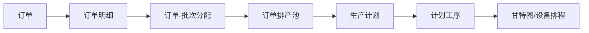
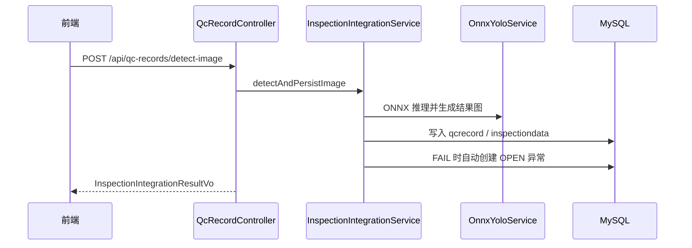
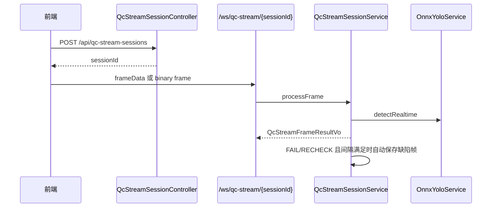

# 代码实现核对报告

更新时间：2026-06-15

本文档以当前代码为唯一事实来源，记录 `docs/` 与真实前后端实现的核对结果。旧文档中保留的“建议、预留、规划”内容不等同于已实现接口；需要联调或验收时，以本文档和后端 Controller/DTO/VO 为准。

## 1. 项目结构与技术栈

| 区域 | 路径 | 当前实现 |
| --- | --- | --- |
| 前端 | `frontend/` | Vue、TypeScript、Vite、Ant Design Vue、Axios、Pinia |
| 后端 | `backend/` | Spring Boot 3.3.5、Java 17、MyBatis-Plus、MySQL、WebSocket、ONNX Runtime |
| 文档 | `docs/` | 方案、接口、数据库、后端说明、实时质检说明、SQL、ONNX 模型 |
| 质检文件 | `photo/` | `upload/` 存原图，`results/` 存算法标注图 |

后端主包为 `com.zhihuitong`。业务模块按 `controller / service / mapper / entity / dto / vo` 分层，真实模块包括：

- `batch`：批次与批次资源池。
- `order`：订单、订单明细、订单批次分配、订单排产池、订单履约聚合。
- `process`：工艺路线、工序、路线工序、设备、设备能力。
- `plan`：生产计划、计划工序、工艺参数。
- `quality`：质检项目、质检记录、质检附件、摄像头、实时质检会话、质检任务聚合。
- `exception`：异常记录、关闭、状态变更、返工登记。
- `ai`：ONNX YOLO 推理与图像预处理。

## 2. 运行、配置与统一约定

### 后端

- 启动命令：`cd backend && mvn spring-boot:run`
- 测试命令：`cd backend && mvn test`
- 服务端口：`8080`
- 数据库：`zhihuitong`
- 数据源环境变量：`MYSQL_HOST`、`MYSQL_PORT`、`MYSQL_DATABASE`、`MYSQL_USERNAME`、`MYSQL_PASSWORD`
- 静态图片映射：`/photo/upload/**`、`/photo/results/**`
- Actuator：`/actuator/health`、`/actuator/info`

### 前端

- 开发命令：`cd frontend && npm run dev`
- 构建命令：`cd frontend && npm run build`
- 类型检查：`cd frontend && npm run type-check`
- 格式化命令：`cd frontend && npm run format`
- Axios `baseURL`：`VITE_APP_BASE_API`，未设置时为 `/prod-api`
- Vite 代理：`/prod-api` 转发到 `http://localhost:8080`，并移除 `/prod-api` 前缀，WebSocket 代理开启。

### 统一响应与错误

单对象响应：

```json
{
  "code": 200,
  "msg": "success",
  "data": {}
}
```

列表响应：

```json
{
  "code": 200,
  "msg": "success",
  "rows": [],
  "total": 0
}
```

分页参数继承自 `PageQuery`：`pageNum` 默认 `1`，`pageSize` 默认 `10`，范围 `1..200`。

当前代码未发现登录、token、cookie、session、权限注解或鉴权中间件；所有业务 Controller 以无鉴权方式开放。CORS 对所有路径开放，允许 `GET/POST/PUT/DELETE/PATCH/OPTIONS`。

常见错误：

| HTTP 状态码 | 来源 | 响应格式 |
| --- | --- | --- |
| 400 | 参数校验、请求体格式、路径参数类型、文件为空/非法图片等 | `{"code":400,"msg":"..."}` |
| 404 | 资源不存在，例如批次、质检记录、实时质检会话不存在 | `{"code":404,"msg":"..."}` |
| 422 | 业务校验失败，例如 YOLO disabled、质检类型不支持、视频质检缺少 `cameraId` | `{"code":422,"msg":"..."}` |
| 500 | 未捕获异常、ONNX 初始化/推理/文件处理失败等 | `{"code":500,"msg":"..."}` |

## 3. 当前完整 API 清单

说明：

- `Auth` 当前均为“无鉴权”。
- `Request` 中的 DTO 名称来自后端代码；字段见后文“请求 DTO 字段速查”。
- `Frontend Usage` 以 `frontend/src/api` 和实际页面路由核对。

### 批次与批次资源池

| Method | Path | Request | Response | Frontend Usage |
| --- | --- | --- | --- | --- |
| GET | `/api/batches` | query: `BatchQuery` | `TableDataInfo<BatchListVo>` | `frontend/src/api/batch/batch.ts`，来料资源池/批次相关页面 |
| GET | `/api/batches/resource-pool` | query: `BatchQuery` | `TableDataInfo<BatchResourcePoolVo>` | `batch.ts`，`/schedule/pool`、`/gray/inbound` |
| GET | `/api/batches/{batchId}` | path: `batchId` | `AjaxResult<BatchDetailVo>` | `batch.ts`，订单详情聚合也会间接使用 |
| POST | `/api/batches` | body: `BatchUpsertRequest` | `AjaxResult<BatchDetailVo>` | `batch.ts` |
| PUT | `/api/batches/{batchId}` | path: `batchId`，body: `BatchUpsertRequest` | `AjaxResult<BatchDetailVo>` | `batch.ts` |
| DELETE | `/api/batches/{batchId}` | path: `batchId` | `AjaxResult` | 后端已实现；前端 API 未发现调用 |
| POST | `/api/batches/import` | multipart: `file` | `AjaxResult<BatchImportResultVo>` | 后端已实现；前端 API 未发现调用 |
| GET | `/api/batches/export` | 无 | 文件流 | 后端已实现；前端 API 未发现调用 |

### 订单

| Method | Path | Request | Response | Frontend Usage |
| --- | --- | --- | --- | --- |
| GET | `/api/orders` | query: `OrderQuery` | `TableDataInfo<OrderListVo>` | `frontend/src/api/order/order.ts`，`/order/list` |
| GET | `/api/orders/{orderId}` | path: `orderId` | `AjaxResult<OrderDetailVo>` | `order.ts`，`/order/list/:id` |
| POST | `/api/orders` | body: `OrderUpsertRequest` | `AjaxResult<OrderListVo>` | `order.ts` |
| PUT | `/api/orders/{orderId}` | path: `orderId`，body: `OrderUpsertRequest` | `AjaxResult<OrderListVo>` | `order.ts` |
| PATCH | `/api/orders/{orderId}/status` | body: `OrderStatusPatchRequest` | `AjaxResult<OrderListVo>` | `order.ts` |
| GET | `/api/orders/{orderId}/items` | path: `orderId` | `AjaxResult<List<OrderItemVo>>` | `order.ts` |
| POST | `/api/orders/{orderId}/items` | body: `OrderItemUpsertRequest` | `AjaxResult<OrderItemVo>` | `order.ts` |
| PUT | `/api/orders/{orderId}/items/{orderItemId}` | body: `OrderItemUpsertRequest` | `AjaxResult<OrderItemVo>` | `order.ts` |
| DELETE | `/api/orders/{orderId}/items/{orderItemId}` | path: `orderId`,`orderItemId` | `AjaxResult` | `order.ts` |
| GET | `/api/orders/{orderId}/batches` | path: `orderId` | `AjaxResult<List<OrderBatchLinkVo>>` | `order.ts` |
| POST | `/api/orders/{orderId}/batches` | body: `OrderBatchLinkUpsertRequest` | `AjaxResult<OrderBatchLinkVo>` | `order.ts` |
| DELETE | `/api/orders/{orderId}/batches/{linkId}` | path: `orderId`,`linkId` | `AjaxResult` | `order.ts` |
| GET | `/api/orders/{orderId}/plans` | path: `orderId` | `AjaxResult<List<OrderPlanSummaryVo>>` | 后端已实现；订单详情聚合可用 |
| GET | `/api/orders/{orderId}/routes` | path: `orderId` | `AjaxResult<List<OrderRouteSummaryVo>>` | 后端已实现；订单详情聚合可用 |
| GET | `/api/orders/{orderId}/machines` | path: `orderId` | `AjaxResult<List<OrderMachineSummaryVo>>` | 后端已实现；订单详情聚合可用 |
| GET | `/api/orders/{orderId}/qc-records` | path: `orderId` | `AjaxResult<List<OrderQcSummaryVo>>` | 后端已实现；订单详情聚合可用 |
| GET | `/api/orders/{orderId}/exceptions` | path: `orderId` | `AjaxResult<List<OrderExceptionSummaryVo>>` | 后端已实现；订单详情聚合可用 |
| GET | `/api/order-schedule-pool` | query: `OrderSchedulePoolQuery` | `TableDataInfo<OrderSchedulePoolVo>` | `order.ts`，`/schedule/order-pool` |

### 工艺、工序、设备

| Method | Path | Request | Response | Frontend Usage |
| --- | --- | --- | --- | --- |
| GET | `/api/process-routes` | query: `ProcessRouteQuery` | `TableDataInfo<ProcessRoute>` | `frontend/src/api/master/process.ts` |
| GET | `/api/process-routes/{routeId}` | path: `routeId` | `AjaxResult<ProcessRouteDetailVo>` | `process.ts` |
| POST | `/api/process-routes` | body: `ProcessRouteUpsertRequest` | `AjaxResult<ProcessRoute>` | `process.ts` |
| PUT | `/api/process-routes/{routeId}` | body: `ProcessRouteUpsertRequest` | `AjaxResult<ProcessRoute>` | `process.ts` |
| DELETE | `/api/process-routes/{routeId}` | path: `routeId` | `AjaxResult` | `process.ts` |
| GET | `/api/process-routes/{routeId}/steps` | path: `routeId` | `AjaxResult<List<RouteStepVo>>` | `process.ts` |
| POST | `/api/process-routes/{routeId}/steps` | body: `RouteStepUpsertRequest` | `AjaxResult<RouteStepVo>` | `process.ts` |
| PUT | `/api/process-routes/{routeId}/steps/{routeStepId}` | body: `RouteStepUpsertRequest` | `AjaxResult<RouteStepVo>` | `process.ts` |
| DELETE | `/api/process-routes/{routeId}/steps/{routeStepId}` | path params | `AjaxResult` | `process.ts` |
| GET | `/api/process-steps` | query: `ProcessStepQuery` | `TableDataInfo<ProcessStep>` | `process.ts` |
| GET | `/api/process-steps/{stepId}` | path: `stepId` | `AjaxResult<ProcessStep>` | `process.ts` |
| POST | `/api/process-steps` | body: `ProcessStepUpsertRequest` | `AjaxResult<ProcessStep>` | `process.ts` |
| PUT | `/api/process-steps/{stepId}` | body: `ProcessStepUpsertRequest` | `AjaxResult<ProcessStep>` | `process.ts` |
| PATCH | `/api/process-steps/{stepId}/status` | body: `IsActivePatchRequest` | `AjaxResult<ProcessStep>` | `process.ts` |
| GET | `/api/machines` | query: `MachineQuery` | `TableDataInfo<MachineVo>` | `frontend/src/api/master/equipment.ts`，`/master/machine` |
| GET | `/api/machines/{machineId}` | path: `machineId` | `AjaxResult<MachineVo>` | `equipment.ts` |
| POST | `/api/machines` | body: `MachineUpsertRequest` | `AjaxResult<MachineVo>` | `equipment.ts` |
| PUT | `/api/machines/{machineId}` | body: `MachineUpsertRequest` | `AjaxResult<MachineVo>` | `equipment.ts` |
| PATCH | `/api/machines/{machineId}/status` | body: `MachineStatusPatchRequest` | `AjaxResult<MachineVo>` | 后端已实现；前端 API 未发现调用 |
| GET | `/api/step-machine-capabilities` | query: `CapabilityQuery` | `TableDataInfo<StepMachineCapability>` | 后端已实现；前端直接调用未发现 |
| POST | `/api/step-machine-capabilities` | body: `CapabilityUpsertRequest` | `AjaxResult<StepMachineCapability>` | 后端已实现；前端直接调用未发现 |
| PUT | `/api/step-machine-capabilities/{capId}` | body: `CapabilityUpsertRequest` | `AjaxResult<StepMachineCapability>` | 后端已实现；前端直接调用未发现 |
| DELETE | `/api/step-machine-capabilities/{capId}` | path: `capId` | `AjaxResult` | 后端已实现；前端直接调用未发现 |

### 排产与工艺参数

| Method | Path | Request | Response | Frontend Usage |
| --- | --- | --- | --- | --- |
| GET | `/api/production-plans` | query: `ProductionPlanQuery` | `TableDataInfo<ProductionPlanListVo>` | `frontend/src/api/plan/plan.ts`，`/schedule/main`、甘特图 |
| POST | `/api/production-plans` | body: `ProductionPlanCreateRequest` | `AjaxResult<ProductionPlanDetailVo>` | `plan.ts` |
| GET | `/api/production-plans/{planId}` | path: `planId` | `AjaxResult<ProductionPlanDetailVo>` | `plan.ts` |
| PUT | `/api/production-plans/{planId}` | body: `ProductionPlanUpdateRequest` | `AjaxResult<ProductionPlanDetailVo>` | `plan.ts` |
| PATCH | `/api/production-plans/{planId}/status` | body: `StatusPatchRequest` | `AjaxResult<ProductionPlanDetailVo>` | `plan.ts` |
| POST | `/api/production-plans/{planId}/reschedule` | body: `PlanRescheduleRequest` | `AjaxResult<ProductionPlanDetailVo>` | `plan.ts` |
| GET | `/api/production-plans/{planId}/gantt` | path: `planId` | `AjaxResult<List<GanttTaskVo>>` | `plan.ts`，`/schedule/board` |
| GET | `/api/plan-steps` | query: `PlanStepQuery` | `TableDataInfo<PlanStepVo>` | `frontend/src/api/plan/planStep.ts`，质检任务/计划页面 |
| GET | `/api/plan-steps/{planStepId}` | path: `planStepId` | `AjaxResult<PlanStepVo>` | `planStep.ts` |
| PUT | `/api/plan-steps/{planStepId}` | body: `PlanStepUpdateRequest` | `AjaxResult<PlanStepVo>` | `planStep.ts` |
| PATCH | `/api/plan-steps/{planStepId}/machine` | body: `PlanStepMachinePatchRequest` | `AjaxResult<PlanStepVo>` | `planStep.ts` |
| PATCH | `/api/plan-steps/{planStepId}/status` | body: `StatusPatchRequest` | `AjaxResult<PlanStepVo>` | `planStep.ts` |
| GET | `/api/process-parameters` | query: `ProcessParameterQuery` | `TableDataInfo<ProcessParameter>` | 后端已实现；前端直接调用未发现 |
| GET | `/api/process-parameters/{paramId}` | path: `paramId` | `AjaxResult<ProcessParameter>` | 后端已实现；前端直接调用未发现 |
| POST | `/api/process-parameters` | body: `ProcessParameterUpsertRequest` | `AjaxResult<ProcessParameter>` | 后端已实现；前端直接调用未发现 |
| PUT | `/api/process-parameters/{paramId}` | body: `ProcessParameterUpsertRequest` | `AjaxResult<ProcessParameter>` | 后端已实现；前端直接调用未发现 |
| DELETE | `/api/process-parameters/{paramId}` | path: `paramId` | `AjaxResult` | 后端已实现；前端直接调用未发现 |

### 质检、附件、实时质检

| Method | Path | Request | Response | Frontend Usage |
| --- | --- | --- | --- | --- |
| GET | `/api/qc-items` | query: `QcItemQuery` | `TableDataInfo<QcItem>` | `frontend/src/api/quality/qcItem.ts`，质检模板/瑕疵页面 |
| GET | `/api/qc-items/{qcItemId}` | path: `qcItemId` | `AjaxResult<QcItem>` | `qcItem.ts` |
| POST | `/api/qc-items` | body: `QcItemUpsertRequest` | `AjaxResult<QcItem>` | `qcItem.ts` |
| PUT | `/api/qc-items/{qcItemId}` | body: `QcItemUpsertRequest` | `AjaxResult<QcItem>` | `qcItem.ts` |
| PATCH | `/api/qc-items/{qcItemId}/status` | body: `QcItemStatusPatchRequest` | `AjaxResult<QcItem>` | `qcItem.ts` |
| GET | `/api/qc-cameras` | query: `QcCameraQuery` | `TableDataInfo<QcCamera>` | `frontend/src/api/quality/qcCamera.ts`，实时质检 |
| GET | `/api/qc-records` | query: `QcRecordQuery` | `TableDataInfo<QcRecord>` | `frontend/src/api/quality/qcRecord.ts`，结果、NCR、返工等页面 |
| GET | `/api/qc-records/{inspectionId}` | path: `inspectionId` | `AjaxResult<QcRecord>` | `qcRecord.ts` |
| POST | `/api/qc-records` | body: `QcRecordUpsertRequest` | `AjaxResult<QcRecord>` | `qcRecord.ts`，手工录入 |
| POST | `/api/qc-records/detect-image` | multipart: `QcDetectImageRequest` | `AjaxResult<InspectionIntegrationResultVo>` | `qcRecord.ts`，`/quality/realtime` 离线图片质检 |
| POST | `/api/qc-records/detect-frame` | multipart: `QcDetectFrameRequest` | `AjaxResult<InspectionIntegrationResultVo>` | `qcRecord.ts`，视频帧检测 |
| PUT | `/api/qc-records/{inspectionId}` | body: `QcRecordUpsertRequest` | `AjaxResult<QcRecord>` | `qcRecord.ts` |
| PATCH | `/api/qc-records/{inspectionId}/review` | body: `QcRecordReviewRequest` | `AjaxResult<QcRecord>` | `qcRecord.ts` |
| PATCH | `/api/qc-records/{inspectionId}/close` | body: `QcRecordCloseRequest` | `AjaxResult<QcRecord>` | `qcRecord.ts` |
| GET | `/api/inspection-data` | query: `InspectionDataQuery` | `TableDataInfo<InspectionData>` | `frontend/src/api/quality/inspectionData.ts` |
| POST | `/api/inspection-data` | body: `InspectionDataUpsertRequest` | `AjaxResult<InspectionData>` | `inspectionData.ts` |
| DELETE | `/api/inspection-data/{dataId}` | path: `dataId` | `AjaxResult` | `inspectionData.ts` |
| GET | `/api/qc-tasks` | query: `QcTaskQuery` | `TableDataInfo<QcTaskVo>` | 后端已实现；前端 `quality/task.ts` 当前由 `planStep + qcRecord` 组合，未直接调用本接口 |
| POST | `/api/qc-stream-sessions` | body: `QcStreamSessionCreateRequest` | `AjaxResult<QcStreamSessionVo>` | `frontend/src/api/quality/qcStreamSession.ts`，`/quality/realtime` |
| POST | `/api/qc-stream-sessions/{sessionId}/snapshot` | multipart: `QcStreamSnapshotRequest` | `AjaxResult<InspectionIntegrationResultVo>` | `qcStreamSession.ts` |
| POST | `/api/qc-stream-sessions/{sessionId}/close` | path: `sessionId` | `AjaxResult` | `qcStreamSession.ts` |
| WebSocket | `/ws/qc-stream/{sessionId}` | text JSON `QcStreamFrameMessage` 或 binary frame | JSON `QcStreamFrameResultVo` | `qcStreamSession.ts` 构建 URL，`RealtimeInspect.vue` 使用 |

实时质检 WebSocket 文本消息：

```json
{
  "frameData": "data:image/jpeg;base64,...",
  "frameTime": "2026-06-15 10:00:00"
}
```

后端也支持 binary frame。响应包含 `sessionId`、`frameTime`、`resultJudge`、`confidenceScore`、`resultValue`、`boxes`、`renderMode`、`autoSaved`，缺陷帧可能自动落库并返回 `inspectionId`、`imageUrl`、`sourceImageUrl`。

### 异常闭环

| Method | Path | Request | Response | Frontend Usage |
| --- | --- | --- | --- | --- |
| GET | `/api/exception-records` | query: `ExceptionRecordQuery` | `TableDataInfo<ExceptionRecord>` | `frontend/src/api/exception/exceptionRecord.ts`，NCR/返工/异常页面 |
| GET | `/api/exception-records/{exceptionId}` | path: `exceptionId` | `AjaxResult<ExceptionRecord>` | `exceptionRecord.ts` |
| POST | `/api/exception-records` | body: `ExceptionRecordUpsertRequest` | `AjaxResult<ExceptionRecord>` | `exceptionRecord.ts` |
| PUT | `/api/exception-records/{exceptionId}` | body: `ExceptionRecordUpsertRequest` | `AjaxResult<ExceptionRecord>` | `exceptionRecord.ts` |
| PATCH | `/api/exception-records/{exceptionId}/status` | body: `ExceptionStatusPatchRequest` | `AjaxResult<ExceptionRecord>` | `exceptionRecord.ts` |
| PATCH | `/api/exception-records/{exceptionId}/close` | body: `ExceptionCloseRequest` | `AjaxResult<ExceptionRecord>` | `exceptionRecord.ts` |
| POST | `/api/exception-records/{exceptionId}/rework` | body: `ExceptionReworkRequest` | `AjaxResult<ExceptionRecord>` | `exceptionRecord.ts` |

## 4. 请求 DTO 字段速查

### 通用分页

| 字段 | 类型 | 必填 | 默认值 | 说明 |
| --- | --- | --- | --- | --- |
| pageNum | long | 否 | 1 | 最小 1 |
| pageSize | long | 否 | 10 | 1 到 200 |

### 主要查询参数

| DTO | 字段 |
| --- | --- |
| `BatchQuery` | `pageNum`, `pageSize`, `batchNo`, `supplier`, `dateFrom`, `dateTo` |
| `OrderQuery` | `pageNum`, `pageSize`, `orderNo`, `customerName`, `status`, `deliveryDateFrom`, `deliveryDateTo` |
| `OrderSchedulePoolQuery` | `pageNum`, `pageSize`, `orderNo`, `customerName`, `status`, `priority`, `readyForSchedule` |
| `ProcessRouteQuery` | `pageNum`, `pageSize`, `routeName`, `isActive` |
| `ProcessStepQuery` | `pageNum`, `pageSize`, `stepCode`, `stepName`, `stepType`, `isActive` |
| `MachineQuery` | `pageNum`, `pageSize`, `machineCode`, `machineName`, `machineType`, `status` |
| `CapabilityQuery` | `pageNum`, `pageSize`, `stepId`, `machineId`, `isActive` |
| `ProductionPlanQuery` | `pageNum`, `pageSize`, `orderId`, `orderItemId`, `batchId`, `routeId`, `status`, `dateFrom`, `dateTo` |
| `PlanStepQuery` | `pageNum`, `pageSize`, `planId`, `stepId`, `machineId`, `status`, `dateFrom`, `dateTo` |
| `ProcessParameterQuery` | `pageNum`, `pageSize`, `planStepId`, `paramType`, `recordTimeFrom`, `recordTimeTo` |
| `QcItemQuery` | `pageNum`, `pageSize`, `qcItemCode`, `qcItemName`, `qcType`, `isActive` |
| `QcCameraQuery` | `pageNum`, `pageSize`, `cameraCode`, `cameraName`, `cameraType`, `status` |
| `QcRecordQuery` | `pageNum`, `pageSize`, `planStepId`, `qcItemId`, `inspectType`, `resultJudge`, `inspectTimeFrom`, `inspectTimeTo` |
| `InspectionDataQuery` | `pageNum`, `pageSize`, `qcRecordId`, `cameraId`, `fileType` |
| `QcTaskQuery` | `pageNum`, `pageSize`, `planId`, `machineId`, `orderId`, `orderItemId`, `batchId`, `keyword`, `status` |
| `ExceptionRecordQuery` | `pageNum`, `pageSize`, `planStepId`, `exceptionType`, `exceptionLevel`, `status` |

### 主要 Body 字段

| DTO | 必填字段 | 可选字段 |
| --- | --- | --- |
| `BatchUpsertRequest` | `batchNo`, `supplier`, `inDate` | `weight`, `width`, `composition`, `note` |
| `OrderUpsertRequest` | `orderNo`, `customerName`, `orderDate`, `deliveryDate`, `status` | `priority`, `remark` |
| `OrderItemUpsertRequest` | `productCode`, `productName`, `quantity` | `specification`, `color`, `unit`, `requiredWidth`, `requiredWeight`, `remark` |
| `OrderBatchLinkUpsertRequest` | `orderItemId`, `batchId` | `allocatedWeight`, `allocatedQuantity`, `remark` |
| `OrderStatusPatchRequest` | `status` | `reason` |
| `ProcessRouteUpsertRequest` | `routeName`, `isActive` | `description` |
| `RouteStepUpsertRequest` | `stepId`, `sortOrder`, `isMandatory` | 无 |
| `ProcessStepUpsertRequest` | `stepCode`, `stepName`, `isActive` | `stepType`, `sortOrder`, `defaultHours`, `description` |
| `IsActivePatchRequest` | `isActive` | 无 |
| `MachineUpsertRequest` | `machineCode`, `machineName`, `status` | `machineType`, `description` |
| `MachineStatusPatchRequest` | `status` | `reason` |
| `CapabilityUpsertRequest` | `stepId`, `machineId`, `isActive` | `minWidth`, `maxWidth`, `maxSpeed`, `maxBatchWeight` |
| `ProductionPlanCreateRequest` | `batchId`, `routeId`, `planStartTime` | `orderId`, `orderItemId`, `remark` |
| `ProductionPlanUpdateRequest` | 无强制必填 | `orderId`, `orderItemId`, `batchId`, `routeId`, `planStartTime`, `planEndTime`, `status`, `remark` |
| `PlanRescheduleRequest` | `rescheduleReason` | `startTime` |
| `PlanStepUpdateRequest` | 无强制必填 | `planStartTime`, `planEndTime`, `planHours`, `sequenceNo`, `status`, `remark` |
| `PlanStepMachinePatchRequest` | `machineId` | 无 |
| `StatusPatchRequest` | `status` | `reason` |
| `ProcessParameterUpsertRequest` | `planStepId`, `paramName`, `paramValue`, `recordTime` | `unit`, `paramType`, `remark` |
| `QcItemUpsertRequest` | `qcItemCode`, `qcItemName`, `isActive` | `qcType`, `unit`, `standardMin`, `standardMax`, `description` |
| `QcItemStatusPatchRequest` | `isActive` | 无 |
| `QcRecordUpsertRequest` | `planStepId`, `qcItemId`, `inspectTime`, `inspectType`, `resultJudge` | `cameraId`, `frameTime`, `imageUrl`, `confidenceScore`, `resultValue`, `inspector`, `remark` |
| `QcRecordReviewRequest` | `reviewResult` | `reviewer`, `reviewRemark` |
| `QcRecordCloseRequest` | 无强制必填 | `closeRemark` |
| `QcDetectImageRequest` | `file`, `planStepId`, `qcItemId` | `cameraId`, `inspector`, `remark` |
| `QcDetectFrameRequest` | `file`, `planStepId`, `qcItemId`, `cameraId` | `frameTime`, `inspector`, `remark` |
| `QcStreamSessionCreateRequest` | `planStepId`, `qcItemId`, `cameraId` | `inspector`, `remark` |
| `QcStreamSnapshotRequest` | `file` | `frameTime`, `resultJudge`, `confidenceScore`, `resultValue`, `remark` |
| `InspectionDataUpsertRequest` | `qcRecordId`, `fileType`, `filePath`, `fileName` | `cameraId`, `captureTime`, `resultSummary`, `remark` |
| `ExceptionRecordUpsertRequest` | `planStepId`, `exceptionType`, `exceptionLevel`, `description`, `createTime`, `status` | `handleResult` |
| `ExceptionStatusPatchRequest` | `status` | `remark` |
| `ExceptionCloseRequest` | `handleResult` | `closeRemark` |
| `ExceptionReworkRequest` | `reworkPlan` | `reworkOwner`, `expectedFinishTime` |

## 5. 模块职责与数据流

### 订单驱动排产

主要文件：

- `modules/order/controller/OrderController.java`
- `modules/order/service/OrderService.java`
- `modules/order/controller/OrderSchedulePoolController.java`
- `modules/plan/controller/ProductionPlanController.java`
- `modules/plan/service/ProductionPlanService.java`
- 前端：`views/order/OrderList.vue`、`views/order/OrderDetail.vue`、`views/schedule/OrderSchedulePool.vue`、`views/plan/PlanMain.vue`

关键流程：



边界条件：

- 订单、订单明细、批次、路线、设备等资源不存在时返回 404。
- 创建计划会展开路线工序并推荐/绑定设备，具体排产算法在 `ProductionPlanService` 内部。
- 批次资源池会根据订单占用、计划状态、剩余重量/数量推导 `resourceStatus`、`readyForSchedule`。

### 质检与异常闭环

主要文件：

- `modules/quality/controller/QcRecordController.java`
- `modules/quality/service/InspectionIntegrationService.java`
- `modules/quality/service/QcStreamSessionService.java`
- `modules/ai/service/OnnxYoloService.java`
- `modules/exception/service/ExceptionRecordService.java`
- 前端：`views/quality/RealtimeInspect.vue`、`ResultList.vue`、`NcrList.vue`、`ReworkList.vue`

图片离线质检流程：



实时视频质检流程：



边界条件：

- `inspectType` 仅支持 `offline` 或 `video`。
- `inspectType=video` 时 `cameraId` 必填。
- `resultJudge` 仅支持代码中的白名单；不支持值返回 422。
- `qc.stream.max-frame-size-bytes` 限制实时帧大小。
- `qc.stream.auto-save-defect-interval-ms` 控制实时缺陷帧自动保存间隔。

## 6. 前端调用与后端实现差异

### 前端调用但后端未匹配到的接口

这些接口存在于 `frontend/src/api`，但当前 Spring Boot 后端未发现对应 Controller。代码表现更像占位、旧 Ruoyi 风格或未接入模块：

- `/business/dispatch/list`
- `/business/report/list`
- `/business/track/list`
- `/business/wip/list`
- `/business/workorder/list`
- `/business/bom/list`
- `/business/colorway/list`
- `/business/customer/list`
- `/business/material/list`
- `/business/master/list`
- `/business/season/list`
- `/business/size-chart/list`
- `/business/supplier/list`
- `/business/trim/list`
- `/business/operation/list`
- `/business/strategy/list`
- `/business/batch-trace/list`
- `/business/material-trace/list`
- `/business/sn-trace/list`
- `/business/style-trace/list`
- `/system/config/list`、`/system/config`
- `/system/dept/list`、`/system/dept`
- `/system/dict/type/list`、`/system/dict/type`、`/system/dict/type/changeStatus`
- `/system/menu/list`、`/system/menu`
- `/system/post/list`、`/system/post`
- `/system/role/list`、`/system/role`、`/system/role/changeStatus`
- `/system/user/list`、`/system/user`、`/system/user/changeStatus`、`/system/user/resetPwd`

处理方式：本文档将这些列为“前端占位/未接入后端”，不再把它们写成已实现后端接口。

### 后端存在但旧 docs 原本缺失或描述不完整的接口

- `POST /api/qc-records/detect-frame`：旧接口文档未完整列入，当前前端和后端均已实现。
- `PATCH /api/process-steps/{stepId}/status`：后端和前端 API 已实现，旧文档只写了工序资源概览。
- `GET /api/qc-tasks`：后端已实现聚合接口，但前端当前未直接调用。
- `GET/POST/PUT/DELETE /api/step-machine-capabilities`：后端已实现，前端页面未发现直接调用。
- `GET/POST/PUT/DELETE /api/process-parameters`：后端已实现，前端页面未发现直接调用。
- `DELETE /api/batches/{batchId}`、`POST /api/batches/import`、`GET /api/batches/export`：后端已实现，前端未发现调用。

### 文档与代码不一致的处理

| 位置 | 原问题 | 处理 |
| --- | --- | --- |
| `接口详细设计.md` | 设计口径和实现口径混在一起，部分接口为建议或预留 | 增加维护提示，明确以本文档为代码核对版 |
| `方案设计.md` | 大量章节是规划/建议，不能直接视为已实现 | 增加维护提示，指向本文档 |
| `数据库设计说明.md` | 引用了不存在的 `docs/order_schema_upgrade.sql` | 增加维护提示，说明订单表已在 `docs/zhihuitong.sql` 中出现，未发现独立升级脚本 |
| `Java后端开发文档.md` | 写有“用户与权限”等后端职责，但当前代码未实现鉴权 | 增加维护提示，本文档明确当前无鉴权 |

## 7. 无法从代码确认的信息

- 未发现正式鉴权、用户、角色、权限、登录态、token、session 代码；前端的 `/system/**` API 也未匹配到后端实现。
- 未发现 Flyway/Liquibase 等迁移工具；数据库初始化以 `docs/zhihuitong.sql` 为准。
- `docs/接口详细设计.md` 中部分“建议返回字段”和旧规划接口未必已经落地，本文档只记录当前代码确认内容。
- 未从代码确认生产部署脚本、容器配置、CI/CD 配置。

## 8. 文档维护记录

- 2026-06-15：新增本代码核对报告，补齐真实 API 清单、前后端差异、模块职责、配置与错误响应约定。
