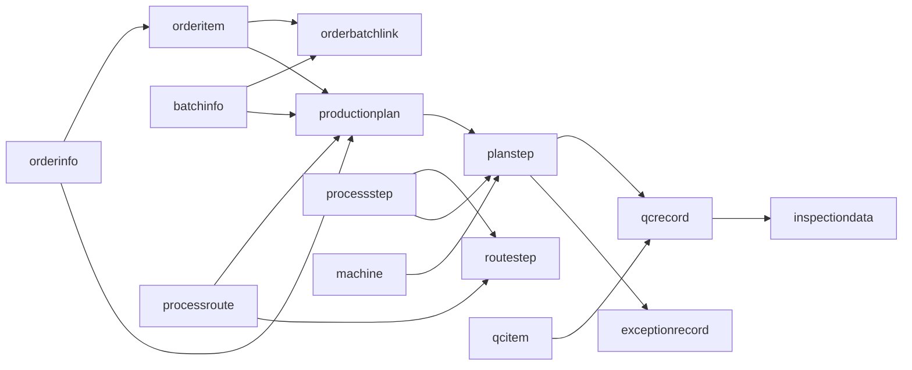

# 数据库设计

更新时间：2026-06-20

数据库：`zhihuitong`，MySQL 8，字符集 `utf8mb4`。

## 1. 初始化脚本

按以下顺序执行：

1. [`zhihuitong.sql`](./zhihuitong.sql)：核心业务表。
2. [`auth_schema.sql`](./auth_schema.sql)：用户权限表及初始角色菜单。
3. [`data_scope_migration.sql`](./data_scope_migration.sql)：业务数据归属字段。

当前没有自动迁移框架，修改实体字段时必须同步 SQL。

AI 决策支持功能不新增业务表。现有数据库只需执行
[`ai_decision_support_migration.sql`](./ai_decision_support_migration.sql) 增加菜单和角色关系。

## 2. 业务表

| 表 | 主键 | 职责 |
| --- | --- | --- |
| `orderinfo` | `orderId` | 订单主表 |
| `orderitem` | `orderItemId` | 订单明细 |
| `orderbatchlink` | `linkId` | 订单明细与批次分配关系 |
| `batchinfo` | `batchId` | 来料批次 |
| `processroute` | `routeId` | 工艺路线 |
| `processstep` | `stepId` | 工序模板 |
| `routestep` | `routeStepId` | 路线工序及顺序 |
| `machine` | `machineId` | 设备 |
| `stepmachinecapability` | `capId` | 工序与设备能力约束 |
| `productionplan` | `planId` | 生产计划 |
| `planstep` | `planStepId` | 生产计划拆分出的工序计划 |
| `processparameter` | `paramId` | 工艺参数 |
| `qcitem` | `qcItemId` | 质检项目与标准 |
| `qccamera` | `cameraId` | 摄像头配置 |
| `qcrecord` | `inspectionId` | 质检记录与 AI 判定 |
| `inspectiondata` | `dataId` | 质检图片及附件 |
| `exceptionrecord` | `exceptionId` | 异常、处理与返工记录 |
| `aischedulerecord` | `recordId` | AI 排产三方案快照、生成状态及人工应用记录 |

## 3. 权限表

| 表 | 职责 |
| --- | --- |
| `sys_user` | 用户、部门、岗位、单角色、密码和状态 |
| `sys_role` | 角色、状态和数据范围 |
| `sys_menu` | 菜单、页面和按钮权限字符串 |
| `sys_role_menu` | 角色菜单关系 |
| `sys_dept` | 部门树及祖先路径 |
| `sys_role_dept` | CUSTOM 数据范围的角色部门关系 |
| `sys_post` | 岗位 |
| `sys_login_log` | 登录成功与失败审计 |

用户当前采用单角色模型：`sys_user.roleId → sys_role.roleId`。

## 4. 核心关系



## 5. 数据范围字段

核心业务数据通过以下字段归属用户和部门：

```text
deptId      数据所属部门
createdBy   数据创建用户
```

当前应用数据范围的主要实体：

- `orderinfo`
- `batchinfo`
- `productionplan`
- `qcrecord`
- `exceptionrecord`

查询使用 `DataScopeService.apply(...)`，详情、修改和删除使用访问断言。历史数据由 `data_scope_migration.sql` 补齐。

## 6. 数据范围枚举

| 值 | 含义 |
| --- | --- |
| `ALL` | 全部数据 |
| `CUSTOM` | `sys_role_dept` 指定部门 |
| `DEPT` | 本部门 |
| `DEPT_AND_CHILD` | 本部门及子部门 |
| `SELF` | 仅本人创建数据 |

## 7. 关键约束

- 用户名、邮箱和手机号具有唯一约束。
- 超级管理员用户和角色不可删除、停用或复制创建。
- 密码仅保存 BCrypt 哈希。
- 角色或用户状态变化后必须删除相关 Redis 会话。
- 订单、批次、工序、路线和计划删除前必须检查业务引用。
- `sys_login_log.browser` 长度为 100，写入前必须截断；审计失败不得中断认证。
- `sys_role_menu`、`sys_role_dept` 是复合关系表，不使用 MyBatis-Plus `selectById/updateById`。

## 8. ID 与时间

- 业务主键主要由 MyBatis-Plus `assign_id` 生成。
- 前端必须把 Long ID 当字符串处理。
- JSON 时间格式：`yyyy-MM-dd HH:mm:ss`。
- 数据库和 Jackson 时区：`Asia/Shanghai`。
