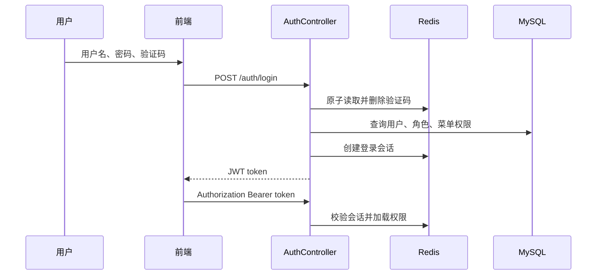

# 权限与认证

更新时间：2026-06-20

## 1. 已确认规则

- 不开放用户自行注册。
- 不支持一个用户绑定多个角色。
- 仅管理员创建账号。
- 引入部门和岗位。
- 超级管理员账号受保护。

## 2. 登录与会话



JWT 只保存会话标识和用户名，实际权限保存在 Redis 会话中。停用、改密、重置密码、角色变更和强制下线通过删除 Redis 会话立即生效。

验证码使用 Redis Lua 原子读取删除，兼容 Redis 5，不依赖 `GETDEL`。

## 3. 初始角色

| 角色键 | 职责 | 数据范围 |
| --- | --- | --- |
| `admin` | 超级管理员 | `ALL` |
| `order_manager` | 订单与批次分配 | `DEPT` |
| `material_manager` | 来料和资源池 | `DEPT` |
| `process_engineer` | 工艺、工序和设备能力 | `DEPT` |
| `scheduler` | 排产和生产计划 | `DEPT_AND_CHILD` |
| `qc_inspector` | 质检执行 | `SELF` |
| `qc_manager` | 质量复核与异常闭环 | `DEPT_AND_CHILD` |
| `viewer` | 授权业务只读 | `DEPT` |

## 4. 功能权限矩阵

图例：`R` 查询，`C` 新增，`U` 修改，`D` 删除，`A` 特殊动作。

| 模块 | admin | order_manager | material_manager | process_engineer | scheduler | qc_inspector | qc_manager | viewer |
| --- | --- | --- | --- | --- | --- | --- | --- | --- |
| 看板 | R | R | R | R | R | R | R | R |
| 订单 | CRUD | CRUD | R | R | R | R | R | R |
| 批次/来料 | CRUD | R/A | CRUD | R | R | R | R | R |
| 工艺路线/工序 | CRUD | R | R | CRUD | R | 质检依赖读取 | R | R |
| 设备/能力 | CRUD | R | R | CRUD | R | R | R | R |
| 生产计划 | CRUD+A | R | R | R | CRUD+A | 工序计划只读 | R | R |
| AI智能排产 | R+A确认 | - | - | - | R+A确认 | - | - | R |
| 实时质检 | CRUD+A | R | R | R | R | C+A检测 | R+A复核 | R |
| AI质检分析 | R | - | - | - | - | R | R | R |
| 异常/返工 | CRUD+A | R | R | R | R | C | CRUD+A | R |
| 用户、角色、菜单 | CRUD+A | - | - | - | - | - | - | - |
| 部门、岗位、在线用户 | CRUD+A | - | - | - | - | - | - | - |

## 5. 权限命名

统一格式：`领域:资源:动作`。

```text
dashboard:view
order:order:list/add/edit/remove
batch:resource:list/add/edit/remove
process:route:list/edit
process:machine:list/edit
plan:production:list/create/edit/reschedule
quality:realtime:view/detect
quality:record:review
exception:record:list/handle/rework
system:user:list/manage
system:role:list/manage
system:menu:list/manage
system:dept:list/manage
system:post:list/manage
system:online:list/forceLogout
```

超级管理员权限：`*:*:*`，菜单键：`*`。

## 6. 特殊权限边界

### 看板

- 菜单和接口统一使用 `dashboard:view`。
- `GET /api/dashboard/overview` 对全部角色开放。
- 聚合结果仍按角色数据范围过滤。
- 看板开放不代表业务接口开放，未授权业务接口继续返回 403。

### 实时质检依赖工序计划

- `GET /api/plan-steps` 与详情接口允许 `plan:production:list` 或 `quality:realtime:view`。
- `PUT/PATCH /api/plan-steps/**` 仍只允许 `plan:production:edit`。
- 质检员可以选择工序计划，但不能修改排产数据。

### 图片与 WebSocket

浏览器原生图片和 WebSocket 无法设置 Bearer Header，因此仅以下路径接受 `access_token` query 参数：

```text
/photo/**
/ws/**
```

普通 API 忽略 query token。

## 7. 前端权限

- 路由守卫：`frontend/src/router/index.ts`
- 菜单过滤：`menuKeys`
- 按钮权限：`frontend/src/directives/permission.ts`
- 登录状态：`frontend/src/stores/auth.ts`
- token 存储：`frontend/src/utils/authToken.ts`

前端权限仅用于体验控制，后端 `@PreAuthorize` 是最终安全边界。

## 8. 维护要求

新增或修改受控接口时必须：

1. 定义精确权限字符串。
2. 在 Controller 添加 `@PreAuthorize`。
3. 更新 `sys_menu` 和角色菜单关系。
4. 同步前端菜单或按钮权限。
5. 检查数据范围是否适用。
6. 在 [测试指南](./测试指南.md) 增加允许和拒绝用例。
7. 更新 [API接口](./API接口.md)。
