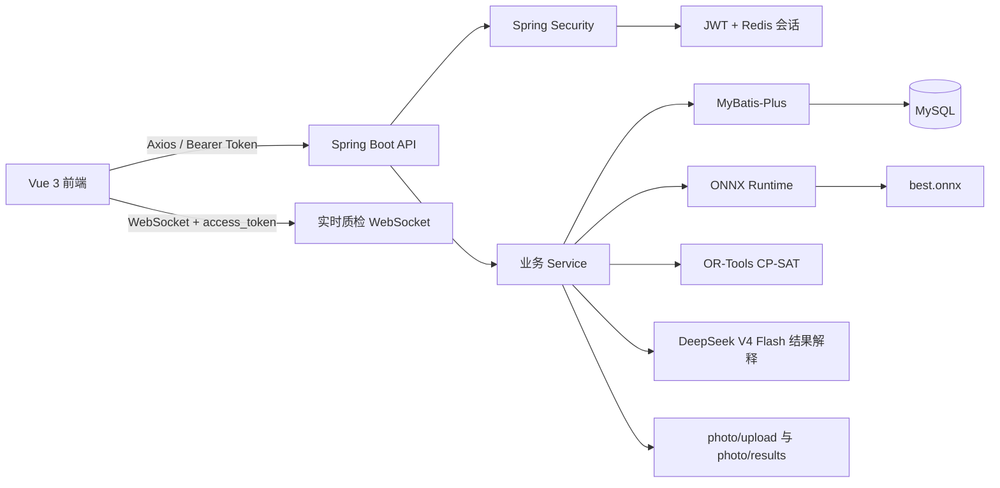

# 系统设计

更新时间：2026-06-20

## 1. 系统定位

AI胚布排产质检系统面向纺织生产场景，采用“订单驱动计划、批次驱动执行”的业务模型，将订单、来料、工艺、设备、排产、AI 质检和异常闭环统一到一个系统。

主业务链路：

```text
订单 → 订单明细 → 批次分配 → 来料批次 → 工艺路线
    → 生产计划 → 工序计划 → AI/人工质检 → 异常与返工
```

## 2. 技术架构



## 3. 后端分层

| 层 | 职责 |
| --- | --- |
| Controller | 路由、参数校验、`@PreAuthorize` 权限入口 |
| DTO / VO | 请求参数和对外响应结构 |
| Service | 业务流程、事务、状态校验、数据范围 |
| Mapper / Entity | MyBatis-Plus 数据访问和表映射 |
| Security | JWT、Redis 会话、验证码、RBAC、数据范围 |
| Common | `AjaxResult`、`TableDataInfo`、统一异常处理 |

## 4. 业务模块

| 模块 | 后端目录 | 前端页面 | 核心职责 |
| --- | --- | --- | --- |
| 看板 | `modules/dashboard` | `views/dashboard` | 使用 `dashboard:view` 聚合当前数据范围内的生产与质量数据 |
| 订单 | `modules/order` | `views/order` | 订单、明细、批次分配、订单聚合详情 |
| 来料 | `modules/batch` | `views/gray` | 来料批次、资源池、导入导出 |
| 工艺 | `modules/process` | `views/master` | 工艺路线、工序、设备、设备能力 |
| 排产 | `modules/plan` | `views/plan`、`views/schedule` | 生产计划、工序计划、重排、甘特图、工艺参数 |
| 质量 | `modules/quality` | `views/quality` | 质检项、摄像头、离线检测、实时检测、复核、附件 |
| 异常 | `modules/exception` | `views/quality` | 异常状态、关闭、返工闭环 |
| 用户权限 | `modules/system`、`security` | `views/auth`、`views/system` | 登录、用户、角色、菜单、部门、岗位、在线会话 |
| AI | `modules/ai` | 由质量模块调用 | ONNX 模型加载、预处理、推理、检测框和结果图 |
| AI 决策支持 | `modules/ai` | `views/plan/AiScheduleAdvisor`、`views/quality/AiQualityAnalysis` | OR-Tools 排产建议、人工确认落库、质检趋势与根因辅助分析、DeepSeek 报告 |

## 5. 核心流程

### 5.1 订单与排产

1. 创建订单和订单明细。
2. 将来料批次分配到订单明细。
3. 选择启用的工艺路线。
4. 创建生产计划。
5. 根据路线工序生成工序计划。
6. 按设备能力匹配机台并生成计划时间。
7. 通过甘特图和重排接口调整执行窗口。

关键边界：

- 同一批次不能存在冲突的活跃计划。
- 删除订单、工序或路线前会检查引用关系。
- 工序计划查询可供实时质检读取，但修改仍要求排产编辑权限。
- AI 智能排产一次生成“交期优先、设备利用率优先、成本优先”三套方案。
- OR-Tools 负责约束求解，DeepSeek 不参与机台和时间决策。
- 建议接口只读；只有拥有重排权限的用户人工确认后才更新计划与工序。
- 每次生成的完整方案保存到 `aischedulerecord`，离开页面或刷新后可恢复历史快照。
- 应用方案时使用原始快照落库，并记录所选策略与应用时间，避免重新计算造成结果漂移。

### 5.2 离线 AI 质检

1. 前端上传图片和工序计划、质检项等业务参数。
2. 后端保存原图。
3. ONNX Runtime 执行推理。
4. 后端生成检测框、判定和结果图。
5. 写入 `qcrecord` 与 `inspectiondata`。
6. 不合格结果可自动创建质量异常。

### 5.3 实时视频质检

1. 前端选择工序计划、质检项和摄像头。
2. 创建 `/api/qc-stream-sessions` 会话。
3. 使用 `/ws/qc-stream/{sessionId}` 建立 WebSocket。
4. 前端按采样间隔发送视频帧。
5. 后端推理并返回实时检测框。
6. 缺陷关键帧可自动或手动保存为正式质检记录。
7. 停止检测时关闭会话。

### 5.4 AI 质检分析

1. 读取指定质检记录的 ONNX 判定、置信度和缺陷类别。
2. 聚合同工序最近 50 条质检记录，计算失败、复检和异常率。
3. 关联最近工艺参数，按缺陷类别生成可能原因与建议动作。
4. DeepSeek V4 Flash 将结构化事实整理为报告；不可用时返回规则降级报告。
5. 所有根因均标记为辅助推测，需要人工复核。

### 5.5 异常闭环

```text
质检 FAIL → 创建/关联异常 → PROCESSING → 返工或处理 → CLOSED
```

异常记录支持状态变更、关闭和返工登记，处理审计写入现有业务字段。

## 6. 统一响应与错误

普通成功响应：

```json
{"code":200,"msg":"success","data":{}}
```

分页响应：

```json
{"code":200,"msg":"success","rows":[],"total":0}
```

| HTTP 状态 | 含义 |
| --- | --- |
| 400 | 参数、验证码或当前密码错误 |
| 401 | 未登录、token 无效或 Redis 会话失效 |
| 403 | 功能权限或数据权限不足 |
| 404 | 资源不存在 |
| 409 | 唯一键、引用或状态冲突 |
| 422 | 业务状态不允许 |
| 500 | 未处理的服务端错误，前端不返回内部堆栈 |

## 7. 当前限制

- 没有 Flyway/Liquibase，数据库升级依赖手工 SQL。
- 前端没有仓库内单元测试或 E2E 测试命令。
- 看板当前基于最多 200 条业务数据聚合，不是专用统计 SQL。
- Vite 主 chunk 较大，构建会给出 chunk size 警告。
- 配置中图片和模型路径仍是本机绝对路径，部署时必须覆盖。
